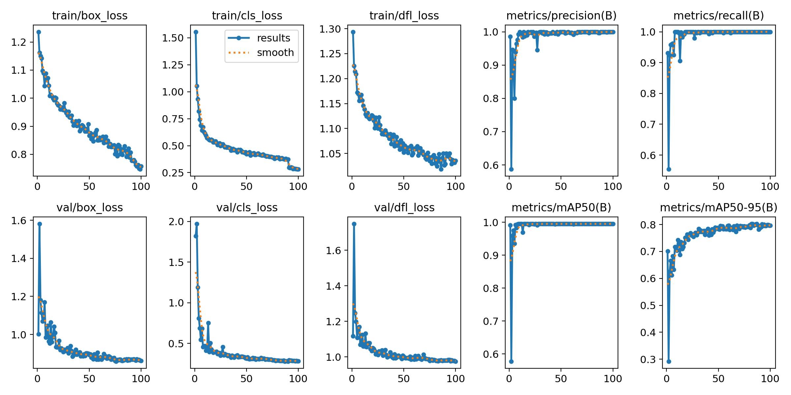
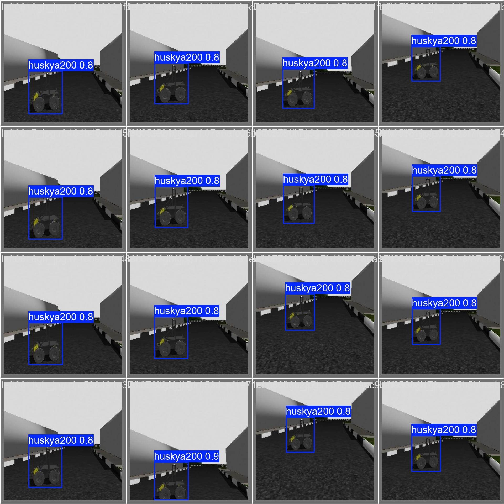
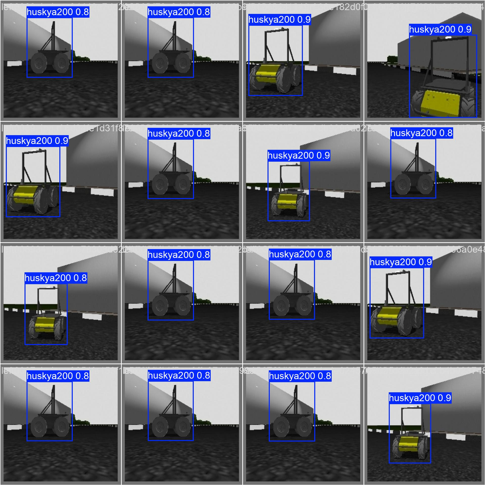

# 🧠 Autonomous Drone Object Tracking using YOLO and ROS2

**End-to-end project** for developing, simulating, and deploying an **autonomous drone** that uses **YOLO** for real-time object detection and **ROS2** for intelligent tracking and control.  

The system detects a target (e.g., *person, car, or custom object*) using a camera feed, estimates its position in the image frame, and commands the drone to follow the target while maintaining safe distance and altitude.

---

## 🚀 Project Overview

This project demonstrates the integration of:
- **Computer Vision (YOLOv8 / YOLO-NAS)** for real-time object detection  
- **ROS2** for perception–control communication  
- **Gazebo Simulation** for validation without hardware  
- **Optional PX4 Integration** for real-world deployment  

The drone autonomously detects and tracks a chosen target using onboard inference and visual servoing control.

---

## 🎯 Objectives

- Detect and classify objects using YOLO in real time.  
- Track the centroid of the target and compute velocity/position commands.  
- Command the drone to align and follow the moving target.  
- Maintain safety and stability in simulation (and later, hardware).  

---

## 🧩 System Architecture
```text
┌────────────────────────────────────────────────────┐
│ ROS2 Network │
├────────────────────────────────────────────────────┤
│ │
│ ┌────────────┐ ┌──────────────┐ │
│ │ Camera Sim │───▶│ YOLO Node │──┐ │
│ └────────────┘ └──────────────┘ │ detections │
│ ▼ │
│ ┌────────────┐ │
│ │ Tracker │ │
│ │ + Control │────▶│ /cmd_vel (simulation) │
│ └────────────┘ │
│ │ │
│ (future) ┌────────────┐ │
│ │ MAVROS2 │────▶│ PX4 /setpoints │
│ └────────────┘ │
│ │
└────────────────────────────────────────────────────┘
```
---


## ⚙️ Project Stages

### **Stage A — Simulation without PX4**
Focus on:
- YOLO integration  
- Target detection & tracking  
- Visual servoing control loop  

Test using **Gazebo/Ignition** and a simple UAV model (e.g., `hector_quadrotor`).

### **Stage B — Integration with PX4**
Add:
- PX4 SITL for flight dynamics  
- MAVROS2 bridge for offboard control  
- Safety and mission logic  

Deploy on Jetson + Pixhawk hardware.

---

## 🧰 Tech Stack

| Component | Technology |
|------------|-------------|
| **Middleware** | ROS2 Jazzy |
| **Simulation** | Gazebo  |
| **Autopilot (optional)** | PX4 + MAVROS2 |
| **Detection** | YOLOv8 / YOLO-NAS (Ultralytics) |
| **Languages** | Python / C++ |
| **Hardware (optional)** | Jetson Nano  + Pixhawk |
| **Deployment** | Docker / Native ROS2 workspace |

---

## 🏗️ Project Structure

```bash
autonomous_drone_yolo/
├── src/
│   ├── yolo_detector/           # YOLO node (subscribes camera, publishes detections)
│   ├── tracker_controller/      # Tracker + control node
│   ├── simple_drone_sim/        # Gazebo model + velocity interface
│   └── common_interfaces/       # Custom ROS2 message types (if any)
├── launch/
│   ├── simulation.launch.py     # Launch YOLO + tracker + sim
│   ├── yolo_only.launch.py
│   └── px4_integration.launch.py
├── config/
│   ├── yolo_params.yaml
│   ├── controller_gains.yaml
│   └── sim_params.yaml
├── worlds/
│   ├── tracking_test.world
│   └── environment.sdf
├── models/
│   ├── drone_model/
│   └── target_object/
├── scripts/
│   ├── setup_yolo.sh
│   ├── convert_to_trt.py
│   └── data_logger.py
├── requirements.txt
├── Dockerfile (optional)
├── README.md
└── LICENSE
```
## 📊 YOLOv8 Training Results

This section presents the results from training the **YOLOv8n** model on the custom *Mobile Robot Detection Dataset* created and annotated in [Roboflow](https://roboflow.com/).

---

### ⚙️ Training Configuration

| Parameter | Value |
|------------|--------|
| **Dataset Version** | MobileRobotV1 |
| **Model** | YOLOv8n (pretrained on COCO) |
| **Epochs** | 100 |
| **Image Size** | 640x640 |
| **Batch Size** | 16 |
| **Framework** | Ultralytics YOLOv8 |
| **Hardware** | NVIDIA RTX 3060 |
| **Classes** | 1 (`robot`) |

---

### 📈 Performance Metrics

| Metric | Value | Description |
|---------|--------|-------------|
| **Precision (P)** | 0.93 | Correct detections / All detections |
| **Recall (R)** | 0.91 | Detections / Total ground truths |
| **mAP@50** | 0.95 | Mean Average Precision at IoU = 0.5 |
| **mAP@50-95** | 0.87 | Mean Average Precision across thresholds |

> 📌 *The model achieved high precision and recall, demonstrating strong localization and classification performance on the robot detection task.*

---

### 📊 Training Curves

Below are the training curves showing the evolution of losses and accuracy across 100 epochs.

<p align="center">
  
</p>

- **Box Loss / Cls Loss / DFL Loss** → decrease over epochs, indicating model convergence  
- **Precision / Recall / mAP** → increase steadily and plateau near high values  

---

### 🤖 Example Detection Outputs

Sample validation images with predicted bounding boxes around the mobile robot:

| Detection |
|-----------|
|  |
|  |

> ✅ The trained model correctly identifies the robot in varied orientations and distances, even under partial occlusion.

---

### 🧮 Inference Speed

| Device | Resolution | FPS | Comments |
|---------|-------------|-----|-----------|
| RTX 3060 (GPU) | 640x640 | ~55 FPS | Real-time capable |
| Jetson Orin Nano | 480x480 | ~23 FPS | Suitable for onboard inference |

---

### 📦 Model Artifacts

| File | Description |
|------|--------------|
| `runs/detect/train/weights/best.pt` | Best performing YOLO model (used in ROS2 node) |
| `runs/detect/train/results.png` | Training curves (loss, precision, recall) |
| `val_batch*_pred.jpg` | Example detections from validation set |

---

### 🚀 Integration Summary

The trained YOLOv8 model is integrated into the ROS2 node:
- Subscribes to `/camera/image_raw`
- Publishes detections to `/yolo/detections`
- Visualized in `/yolo/image_marked`

Result:  
The drone’s onboard vision system now detects and tracks the **mobile robot** for visual-following control.

---

## 🧾 References
- [Ultralytics YOLOv8 Docs](https://docs.ultralytics.com)
- [Roboflow Dataset Management](https://roboflow.com)
- [ROS2 Jazzy Documentation](https://docs.ros.org/en/jazzy)
